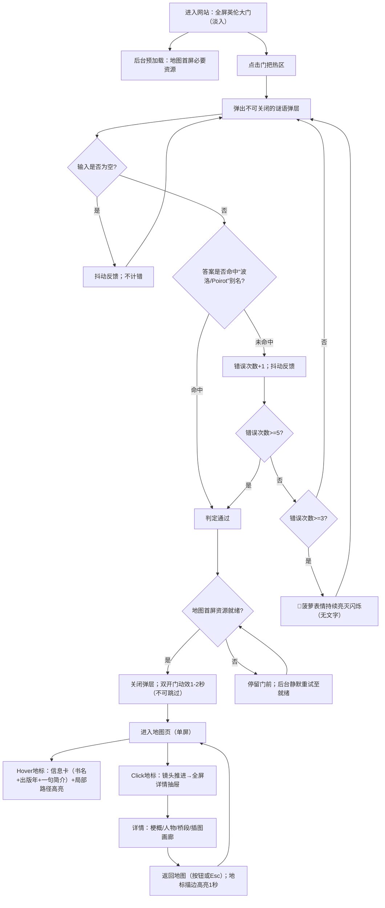
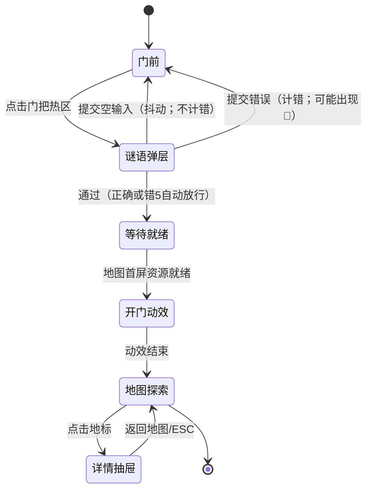
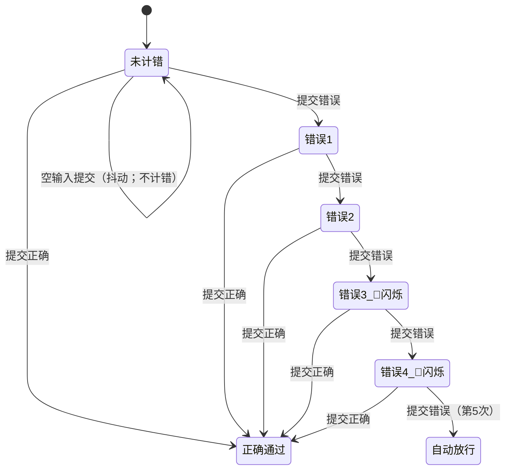
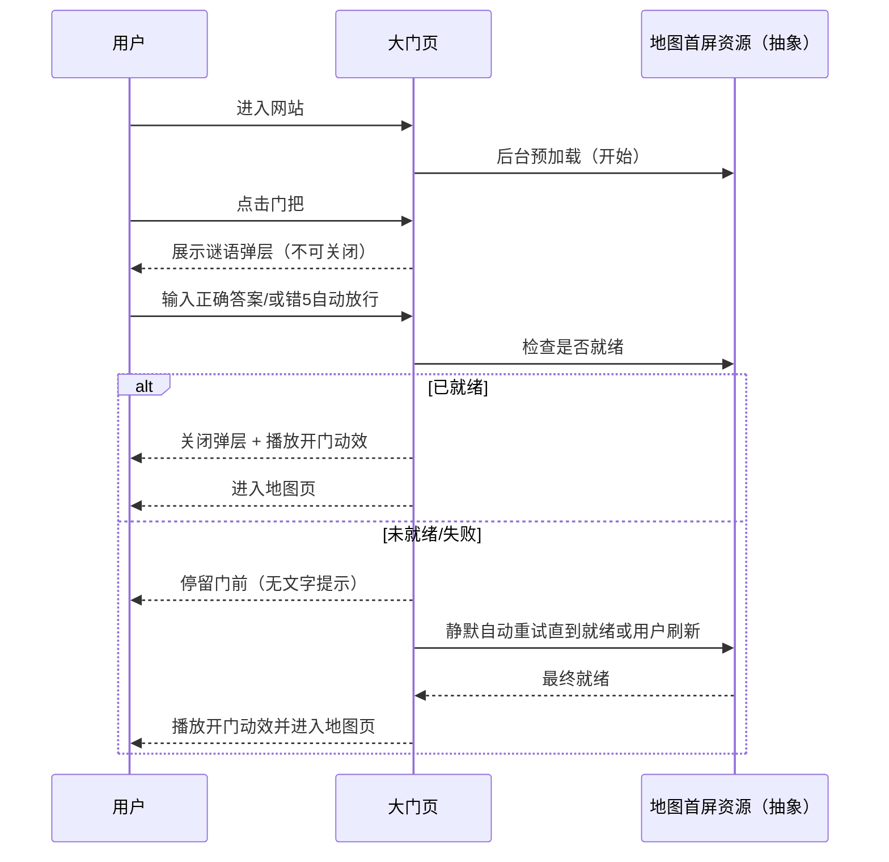

# 产品需求文档：阿加莎小说沉浸式记忆站（MVP） - V0.1

## 1. 综述 (Overview)

### 1.1 项目背景与核心问题
过去的闲暇午后，阅读阿加莎的悬疑小说是一段强烈的个人沉浸体验；但进入工作后，信息洪流冲刷记忆，导致对小说内容与“世界体感”的回忆变得模糊。本项目希望以作品集网站的方式，把“读过阿加莎的人”重新带回那种沉浸式的阅读记忆里，并能快速找回关键内容。

**目标用户**
- 看过阿加莎小说、能够回答“波洛/Poirot”谜语的人（包括我自己）。

**核心痛点**
1. 对小说内容与主线梗概的记忆缺失
2. 对小说世界的体感/画面感不强，希望借助 AI 预生成插图增强沉浸
3. 对精彩桥段与故事走向记忆缺失
4. 对人物性格与形象模糊

**MVP 目标**
- 用“英伦大门 + 谜语门禁”建立仪式感入口
- 用“单屏牛皮纸藏宝图”承载 8 本小说探索路径
- 在书籍详情中提供结构化回忆：梗概 / 人物 / 精彩桥段 + 预生成插图画廊
- 插图为预生成并在站内稳定展示；Prompt 作为创作交付物仅给站点作者，不对用户展示

**MVP 约束**
- 仅桌面端
- 不需要账号/登录
- 不做站内中英文切换（V2）

### 1.2 核心业务流程 / 用户旅程地图
1. **阶段一：沉浸式入口与谜语门禁** - 用户进入全屏英伦大门场景，点击门把触发谜语，回答“波洛/Poirot”后进入世界。
2. **阶段二：小说地图导航（单屏探索）** - 用户在牛皮纸藏宝图上 hover 查看书名与简介，沿 1→8 的路径探索并点击地标。
3. **阶段三：书籍回顾详情（同页抽屉）** - 用户在同页全屏详情抽屉中回忆梗概/人物/桥段并浏览预生成插图，随后返回地图继续探索。
4. **阶段四：插图资产与 Prompt 台账（创作者侧）** - 预生成并管理全站统一风格的插画资产，保证可复现与可迭代（对普通用户不可见）。

### 1.3 Mermaid 图（流程/状态/时序）
> 说明：Mermaid 图用于“需求对齐”，避免歧义；避免写成技术实现细节（不要写 API 路径、字段、HTTP code、框架/库）。

#### 1.3.1 用户操作流（必填）


#### 1.3.2 状态机（当存在明确状态流转对象时必填）
**状态机A：站点主界面（用户可见）**


**状态机B：谜语错误次数（用户可见反馈）**


#### 1.3.3 关键场景时序（仅当“时序/并发/重试/超时”影响用户可见结果时填写）


### 1.4 范围与非目标（MVP）
**范围（MVP）**
- 大门首屏（全屏插画、门把热区、光晕提示、淡入、插画失败降级）
- 谜语弹层（不可关闭、模糊匹配、错3🍍闪烁、错5自动放行、抖动反馈）
- 开门转场（双开门、1–2s、不可跳过、地图首屏资源就绪门槛、失败静默重试）
- 单屏地图（8地标+路径编号、Hover 信息卡、点击进入详情抽屉）
- 书籍详情（梗概/人物/桥段/插图画廊、可折叠、可剧透、返回地图）
- 插图资产交付规范 + Prompt 台账（仅给站点作者）

**非目标（V2+）**
- 移动端适配
- 中英文切换（MVP 仅中文，但数据结构预留）
- 详情页 Hero 首图
- 人物头像插图
- 桥段与插图联动（桥段卡带缩略图）
- 地图分层（底图/地标/路径拆层以增强高亮表现）
- 账号、收藏、笔记、跨设备同步

## 2. 用户故事详述 (User Stories)

### 阶段一：沉浸式入口与谜语门禁

---

#### **US-01: 作为读者，我希望进入网站就看到全屏英伦大门并能自然发现门把入口，以便开始谜语并进入地图世界。**
*   **价值陈述 (Value Statement)**:
    *   **作为** 看过阿加莎小说并愿意参与仪式感入口的读者
    *   **我希望** 首屏全屏大门、无文字、门把有微弱光晕提示
    *   **以便于** 不靠说明也能知道“从哪里进入”
*   **业务规则与逻辑 (Business Logic)**:
    1.  **前置条件**: 仅桌面端（MVP）
    2.  **操作流程 (Happy Path)**:
        1. 用户进入网站，页面从黑场/淡入过渡到全屏英伦大门静态插画。
        2. 门把附近存在微弱光晕提示（不出现文字）。
        3. 用户点击门把附近热区（比门把本体略大一圈）触发 US-02（谜语弹层）。
    3.  **异常处理 (Error Handling)**:
        * 大门插画加载失败时，降级为纯色/纹理背景，但仍保留门把热区与光晕提示，用户仍可进入 US-02。
        * 用户点击非门把热区：不提示、不跳转、不弹层。
*   **验收标准 (Acceptance Criteria)**:
    *   **场景1: 首屏展示（有淡入）**
        *   **GIVEN** 我使用桌面端首次进入网站
        *   **WHEN** 页面加载完成
        *   **THEN** 我看到全屏英伦大门画面，页面无文字，门把附近有微弱光晕提示。
    *   **场景2: 插画失败降级**
        *   **GIVEN** 大门插画加载失败
        *   **WHEN** 页面进入可交互状态
        *   **THEN** 我看到降级背景但仍存在门把热区与光晕提示，且仍可进入谜语弹层。
    *   **场景3: 误触无响应**
        *   **GIVEN** 首屏已展示
        *   **WHEN** 我点击非门把热区
        *   **THEN** 页面不发生变化。
---
*   **页面布局线框图 (ASCII Wireframe)**:
    ```text
    +----------------------------------------------------------------------------------+
    |                              （全屏：英伦大门静态插画）                           |
    |                                                                                  |
    |                         （门把附近：微弱光晕提示，无文字）                        |
    |                                       [ ◎ ]                                      |
    |                           （可点击热区：门把周围一小圈）                          |
    |                                                                                  |
    +----------------------------------------------------------------------------------+
    ```

---

#### **US-02: 作为参与者，我希望点击门把后弹出不可关闭的谜语弹层并输入答案，以便通过“波洛/Poirot”进入开门流程。**
*   **价值陈述 (Value Statement)**:
    *   **作为** 能回答谜语的阿加莎读者
    *   **我希望** 用一个谜语门禁确认“我属于这里”
    *   **以便于** 获得仪式感并进入地图探索
*   **业务规则与逻辑 (Business Logic)**:
    1.  **前置条件**: 已在大门页点击门把热区
    2.  **操作流程 (Happy Path)**:
        1. 弹出谜语弹层，展示完整谜面与输入框；输入框自动聚焦。
        2. 用户输入答案并提交（支持回车与按钮）。
        3. 系统按“模糊不敏感”规则判断答案，命中则判定通过，进入 US-03。
    3.  **异常处理 (Error Handling)**:
        * 弹层不可关闭：无关闭按钮，Esc/点遮罩均无效。
        * 空输入提交：抖动反馈，但不计入错误次数。
        * 错误提交：抖动反馈、错误次数+1；无文字提示。
        * 错误次数达到 3 次：出现🍍菠萝表情，并从此持续亮灭交替闪烁（无文字）。
        * 错误次数达到 5 次：自动放行（等同通过，进入 US-03）。
    4.  **答案判定规则（需求侧）**:
        * **通过别名**（任一命中即通过）：`波洛` / `Poirot` / `Hercule Poirot` / `赫尔克里·波洛`
        * **模糊不敏感**：忽略大小写、空格与常见分隔符号（目标是“用户不用严格对齐格式也能通过”）
        * **明确不接受**：`菠萝` / `pineapple` 不能作为正确答案
*   **验收标准 (Acceptance Criteria)**:
    *   **场景1: 弹层出现与锁定**
        *   **GIVEN** 我点击门把热区
        *   **WHEN** 弹层出现
        *   **THEN** 我无法通过 Esc/点遮罩关闭弹层，且输入框自动聚焦。
    *   **场景2: 空输入不计错但抖动**
        *   **GIVEN** 弹层已出现
        *   **WHEN** 我空输入提交
        *   **THEN** 输入区抖动反馈且错误次数不增加。
    *   **场景3: 错3次出现🍍并持续闪烁**
        *   **GIVEN** 我已累计2次错误
        *   **WHEN** 我第3次提交错误
        *   **THEN** 出现🍍菠萝表情并持续亮灭交替闪烁（无文字提示）。
    *   **场景4: 错5次自动放行**
        *   **GIVEN** 我已累计4次错误
        *   **WHEN** 我第5次提交错误
        *   **THEN** 系统自动放行并进入 US-03。
    *   **场景5: 正确别名通过**
        *   **GIVEN** 弹层已出现
        *   **WHEN** 我输入命中任一别名（如 Poirot / 波洛 / Hercule Poirot / 赫尔克里·波洛）并提交
        *   **THEN** 系统判定通过并进入 US-03。
    *   **场景6: 菠萝不算答案**
        *   **GIVEN** 弹层已出现
        *   **WHEN** 我仅输入菠萝/pineapple并提交
        *   **THEN** 系统计为错误（不会通过）。
---
*   **页面布局线框图 (ASCII Wireframe)**:
    ```text
    +--------------------------------------------------------------+
    |  谜语：                                                      |
    |  比利时来的小个子...你能说出他的名字吗？                      |
    |                                                              |
    |  [ 输入答案 ____________________________ ]  [ 确认 / Enter ]  |
    |                       (错误>=3：🍍 闪烁)                      |
    +--------------------------------------------------------------+
    ```

---

#### **US-03: 作为参与者，我希望谜语通过后看到双开门打开的转场动效，并无缝进入地图页，以便开始探索八本小说。**
*   **价值陈述 (Value Statement)**:
    *   **作为** 已通过谜语门禁的参与者
    *   **我希望** 通过开门动效获得“进入世界”的仪式感
    *   **以便于** 自然衔接到地图探索
*   **业务规则与逻辑 (Business Logic)**:
    1.  **前置条件**: US-02 判定通过（正确或错5自动放行）
    2.  **操作流程 (Happy Path)**:
        1. 用户进入大门页后，系统即后台预加载“地图首屏必要资源”。
        2. 当用户通过谜语且资源就绪时：关闭谜语弹层 → 播放双开门动效（1–2秒，不可跳过）→ 进入地图页（US-04）。
    3.  **异常处理 (Error Handling)**:
        * **就绪门槛**：开门动效开始前，地图首屏必要资源必须已就绪（地图底图、地标可交互热点、hover信息卡基础文案/样式）。
        * 若用户通过谜语时资源未就绪/预加载失败：不进入地图页，停留门前；后台静默自动重试直到就绪或用户刷新（无文字提示）。
        * 从“通过谜语”到“进入地图页”期间，门把不可重复触发谜语（防重复弹层/重复开门）。
    4.  **动效规格**:
        * 双开门向两侧打开
        * 时长 1–2 秒
        * 不允许跳过
*   **验收标准 (Acceptance Criteria)**:
    *   **场景1: 预加载启动**
        *   **GIVEN** 我进入大门页
        *   **WHEN** 页面进入可交互状态
        *   **THEN** 地图首屏必要资源开始后台预加载。
    *   **场景2: 通过后开门进入地图**
        *   **GIVEN** 我通过谜语
        *   **WHEN** 地图首屏必要资源已就绪
        *   **THEN** 弹层关闭并播放双开门动效（1–2秒），结束后进入地图页。
    *   **场景3: 资源未就绪则阻断并静默重试**
        *   **GIVEN** 我通过谜语
        *   **WHEN** 地图首屏必要资源未就绪或预加载失败
        *   **THEN** 我停留在门前且不进入地图页；系统后台静默自动重试直到就绪或我刷新页面。
    *   **场景4: 动效/等待期间锁定交互**
        *   **GIVEN** 我已通过谜语且正在等待就绪或播放开门动效
        *   **WHEN** 我点击页面/按键/再次点门把
        *   **THEN** 不会重复弹出谜语，也不会触发新的交互。
---
*   **页面布局线框图 (ASCII Wireframe)**:
    ```text
    [Door Closed] -> [Double Door Opening 1-2s] -> [Full-screen Map]
    ```

### 阶段二：小说地图导航（单屏探索）

---

#### **US-04: 作为读者，我希望进入地图页就看到全屏牛皮纸藏宝图风格（英伦气质）的单屏地图，并呈现8个地标与1→8路径编号，以便探索并选择一本书进入详情。**
*   **价值陈述 (Value Statement)**:
    *   **作为** 已进入“世界”的读者
    *   **我希望** 一眼看到完整探索地图与路径顺序
    *   **以便于** 在单屏内沉浸式漫游与选择
*   **业务规则与逻辑 (Business Logic)**:
    1.  **前置条件**: US-03 完成开门并进入地图页
    2.  **操作流程 (Happy Path)**:
        1. 地图页全屏展示牛皮纸藏宝图风格底图（英伦气质；不强调真实地理轮廓）。
        2. 地图上固定呈现 8 个可交互地标与 1→8 的路径编号。
        3. 用户可在单屏内 hover/click（US-05/US-06），无滚动、无缩放操作。
    3.  **异常处理 (Error Handling)**:
        * **最小支持尺寸**：`1366×768`；在该尺寸及以上必须保证 8 地标完整可见且无滚动条。
        * 低于最小尺寸：展示全屏遮罩，提示用户放大窗口/更换更大屏幕（阻断探索）。
    4.  **设计与沉浸约束**:
        * 基准设计尺寸：`1920×1080`
        * 地标默认同等可见（不突出某一本）
        * 地图页不提供“返回大门/重置”等按钮（保持沉浸）
*   **验收标准 (Acceptance Criteria)**:
    *   **场景1: 基准尺寸单屏呈现**
        *   **GIVEN** 我的视窗为 `1920×1080`
        *   **WHEN** 我进入地图页
        *   **THEN** 地图全屏显示，8地标与1→8路径编号完整可见，页面无滚动条。
    *   **场景2: 最小尺寸可用**
        *   **GIVEN** 我的视窗为 `1366×768`
        *   **WHEN** 我进入地图页
        *   **THEN** 8地标仍完整可见且可交互，页面无滚动条。
    *   **场景3: 低于最小尺寸阻断**
        *   **GIVEN** 我的视窗小于 `1366×768`
        *   **WHEN** 我进入地图页
        *   **THEN** 出现全屏遮罩提示放大窗口/更换更大屏幕，地图探索交互不可用。
---
*   **页面布局线框图 (ASCII Wireframe)**:
    ```text
    +----------------------------------------------------------------------------------+
    |（全屏：牛皮纸/墨线/旧世纪质感，英伦气质）                                          |
    |  (1)庄园  . . . . (2)东方快车  . . . . (3)ABC线索点                                 |
    |     \                         . . . .                                              |
    |      . . . . (4)尼罗河蒸汽船/神庙 . . . . (5)孤岛庄园 . . . . (6)海滨酒店 . . . . (7)公告栏 |
    |                                                           \                       |
    |                                                            . . . . (8)帷幕庄园    |
    +----------------------------------------------------------------------------------+
    ```

---

#### **US-05: 作为读者，我希望hover地标时出现信息卡（书名+出版年+一句简介）并高亮相关路径段，以便快速决定是否点击进入详情。**
*   **价值陈述 (Value Statement)**:
    *   **作为** 正在地图上探索的读者
    *   **我希望** 不点击就能快速了解每本书的定位与吸引点
    *   **以便于** 更高效地选择进入详情
*   **业务规则与逻辑 (Business Logic)**:
    1.  **前置条件**: 已进入地图页且地标可交互
    2.  **操作流程 (Happy Path)**:
        1. 鼠标进入某地标热区后延迟 150ms 显示信息卡；移出后延迟 150ms 隐藏（防抖）。
        2. 信息卡内容（MVP 中文）：序号(1-8)、中文书名、出版时间、一句简介。
        3. hover时：地标轻微高亮；路径高亮与该地标相连的段（上一节点→当前、当前→下一节点）。
        4. 信息卡可被“接住”：鼠标从地标移动到信息卡上时，信息卡保持显示；只有离开“地标热区+信息卡区域”后才开始隐藏计时。
        5. 信息卡自动避让屏幕边缘，确保不出屏；同一时刻只显示一张信息卡。
    3.  **异常处理 (Error Handling)**:
        * 快速切换 hover 时，信息卡内容切换应平滑、不明显闪烁。
    4.  **V2 预留**:
        * 文案数据结构支持中英两套（MVP 仅展示中文）
*   **验收标准 (Acceptance Criteria)**:
    *   **场景1: Hover出现并高亮**
        *   **GIVEN** 我把鼠标移入某地标热区
        *   **WHEN** 停留 ≥150ms
        *   **THEN** 出现信息卡且不出屏，同时地标与相连路径段高亮。
    *   **场景2: 可接住**
        *   **GIVEN** 信息卡已显示
        *   **WHEN** 我把鼠标从地标移动到信息卡上
        *   **THEN** 信息卡持续显示不消失。
    *   **场景3: 移出隐藏**
        *   **GIVEN** 信息卡已显示
        *   **WHEN** 我离开地标热区与信息卡区域
        *   **THEN** ≥150ms 后信息卡隐藏，高亮恢复。
---
*   **页面布局线框图 (ASCII Wireframe)**:
    ```text
    [地标] (hover高亮)    （路径局部高亮）
          +---------------------------+
          | (3) ABC 谋杀案            |
          | 1936                      |
          | 一句话简介...             |
          +---------------------------+
    ```

**信息卡文案数据（MVP 中文）**
1. 《罗杰疑案》 1926 - 波洛系列成名作，叙述性诡计开山之作，颠覆推理叙事逻辑。
2. 《东方快车谋杀案》 1934 - 波洛标志性作品，震撼结局之一，探讨法律与正义边界。
3. 《ABC 谋杀案》 1936 - 波洛连环杀人经典，开创“藏叶于林”犯罪模式，心理诡计极致。
4. 《尼罗河上的惨案》 1937 - 爱情与阴谋交织，精密不在场证明的代表作。
5. 《无人生还》 1939 - 无侦探模式巅峰，暴风雪山庄标杆，全球销量超 1 亿册。
6. 《阳光下的罪恶》 1941 - 海滨谋杀案，破解时间骗局，人性欲望的深刻暴露。
7. 《谋杀启事》 1950 - 马普尔系列巅峰，乡村谋杀典范，从日常洞察揭开秘密。
8. 《帷幕》 1975 - 波洛最终一案，与宿敌终极对决，侦探生涯的悲壮落幕。

**地标建筑设定（AAAA AAAA）**
1. 罗杰疑案：英国乡村庄园大宅（常春藤+尖顶烟囱）
2. 东方快车谋杀案：雪夜豪华列车+站台蒸汽
3. ABC 谋杀案：复古邮筒+字母线索（ABC）
4. 尼罗河上的惨案：尼罗河蒸汽船+埃及神庙剪影
5. 无人生还：孤岛悬崖庄园+暴风雨海面
6. 阳光下的罪恶：海滨度假酒店+遮阳伞
7. 谋杀启事：乡村小镇集市/公告栏（“启事”意象）
8. 帷幕：古老庄园+厚重窗帘剪影（终局感）

---

#### **US-06: 作为读者，我希望点击地标后在同页打开全屏书籍详情抽屉，并能明确返回地图，以便深入阅读并继续探索。**
*   **价值陈述 (Value Statement)**:
    *   **作为** 在地图上做出选择的读者
    *   **我希望** 进入详情不“跳出世界”，而是在同页展开阅读
    *   **以便于** 保持探索连贯性并快速回到地图
*   **业务规则与逻辑 (Business Logic)**:
    1.  **前置条件**: 地图页可交互
    2.  **操作流程 (Happy Path)**:
        1. 用户点击某地标后，先出现“镜头推进聚焦该地标”的转场，再展开全屏详情抽屉/弹层覆盖地图。
        2. 抽屉打开后：背景地图变暗+轻微模糊，且不可交互。
        3. 用户可通过左上角 `← 返回地图` 或按 `Esc` 关闭抽屉返回地图。
        4. 关闭回地图后：刚才地标以“发光描边”高亮约 1 秒提示定位。
    3.  **异常处理 (Error Handling)**:
        * 不允许点击背景/遮罩关闭详情抽屉（避免误触退出）。
        * 若详情内容/插图未就绪，抽屉内可使用占位/骨架承接（不强制文字）。
    4.  **约束**:
        * 不提供“上一部/下一部”切书（MVP）
*   **验收标准 (Acceptance Criteria)**:
    *   **场景1: 打开详情**
        *   **GIVEN** 我在地图页点击某地标
        *   **WHEN** 打开详情
        *   **THEN** 先出现镜头推进转场，随后全屏详情抽屉展开。
    *   **场景2: 背景不可交互且不可点背景关闭**
        *   **GIVEN** 详情抽屉已打开
        *   **WHEN** 我点击背景地图/遮罩
        *   **THEN** 不会关闭抽屉，且地图不响应交互。
    *   **场景3: 关闭返回地图**
        *   **GIVEN** 详情抽屉已打开
        *   **WHEN** 我点击 `← 返回地图` 或按 `Esc`
        *   **THEN** 抽屉关闭并回到地图页，刚才地标发光描边高亮约 1 秒后恢复。
---
*   **页面布局线框图 (ASCII Wireframe)**:
    ```text
    [Map] Click 地标 -> [镜头推进聚焦] -> [全屏详情抽屉]
    +--------------------------------------------------------------+
    | [← 返回地图]                      书名 / 出版年               |
    +--------------------------------------------------------------+
    | 内容区（可滚动：US-07）                                       |
    +--------------------------------------------------------------+
    ```

### 阶段三：书籍回顾详情（同页抽屉）

---

#### **US-07: 作为读者，我希望在书籍详情中用清晰分区回忆梗概、人物与精彩桥段，并浏览预生成插图增强画面感，以便重新沉浸并找回记忆。**
*   **价值陈述 (Value Statement)**:
    *   **作为** 已选择某一本书的读者
    *   **我希望** 用结构化内容快速找回记忆节点
    *   **以便于** 重新沉浸并重建人物与故事画面
*   **业务规则与逻辑 (Business Logic)**:
    1.  **前置条件**: 已打开 US-06 详情抽屉
    2.  **操作流程 (Happy Path)**:
        1. 顶部固定区：`← 返回地图`（含文字）、书名（中文）、出版年。
        2. 内容区可滚动，分 4 个分区：`梗概` / `人物` / `精彩桥段` / `插图`。
        3. 默认状态：进入详情时**默认展开“梗概”**，其余折叠；分区可独立展开（可同时展开多个）。
        4. 梗概采用模板：**一句话回忆 + 三段式（开端/发展/真相）**；允许剧透。
        5. 人物为文字人物卡（MVP 不做头像插图，V2 再做）。
        6. 精彩桥段每本书先做 3 条，纯文字（V2 再做配图联动）。
        7. 插图为预生成画廊：缩略图列表；点击可放大预览并关闭返回详情。
        8. Prompt 不在站内展示（仅作为创作者交付物提供，见 US-08）。
    3.  **异常处理 (Error Handling)**:
        * 插图未就绪时可显示占位/骨架，不阻断阅读（不强制文字）。
*   **验收标准 (Acceptance Criteria)**:
    *   **场景1: 默认结构可用**
        *   **GIVEN** 我打开任一本书详情
        *   **WHEN** 页面渲染完成
        *   **THEN** 我看到四个分区，且默认展开梗概。
    *   **场景2: 分区展开/折叠**
        *   **GIVEN** 详情已打开
        *   **WHEN** 我点击任一分区标题
        *   **THEN** 该分区按预期折叠/展开，且不影响顶部返回入口。
    *   **场景3: 插图预览**
        *   **GIVEN** 插图画廊已显示
        *   **WHEN** 我点击某张缩略图
        *   **THEN** 我能查看放大预览，并能关闭回到详情。
    *   **场景4: Prompt 不对用户展示**
        *   **GIVEN** 我是普通用户
        *   **WHEN** 我浏览详情页任意区域
        *   **THEN** 我看不到任何 prompt 文本或生成参数。
---
*   **页面布局线框图 (ASCII Wireframe)**:
    ```text
    +----------------------------------------------------------------------------------+
    | [← 返回地图]                         书名（中文）              1934              |
    +----------------------------------------------------------------------------------+
    | 梗概（默认展开）                                                                  |
    | - 一句话回忆                                                                      |
    | - 开端 / 发展 / 真相（允许剧透）                                                  |
    +----------------------------------------------------------------------------------+
    | 人物（默认折叠，可展开；文字卡）                                                  |
    +----------------------------------------------------------------------------------+
    | 精彩桥段（默认折叠，可展开；每本3条；纯文字）                                     |
    +----------------------------------------------------------------------------------+
    | 插图（默认折叠，可展开；画廊；点开大图预览）                                      |
    +----------------------------------------------------------------------------------+
    ```

### 阶段四：插图资产与 Prompt 台账（创作者侧）

---

#### **US-08: 作为站点创作者，我希望准备统一风格的预生成图片资产，并维护可复现的Prompt台账，以便站内稳定展示并持续迭代。**
*   **价值陈述 (Value Statement)**:
    *   **作为** 站点创作者
    *   **我希望** 一次性产出全站插画资产并保留生成依据
    *   **以便于** 风格统一、展示稳定、后续可复现与迭代
*   **业务规则与逻辑 (Business Logic)**:
    1.  **工具无关**: MVP 生图工具不强制指定（可用 NanoBnana Pro 或 即梦AI）；要求支持 `16:9` 且输出至少 `1920×1080`。
    2.  **MVP 地图资产形态**: 采用单张完整地图大图（底图+地标+路径合成一张）；交互热区与高亮效果由前端叠加实现（V2 再做分层地图）。
    3.  **资产清单（MVP）**:
        * 大门首屏插画：1 张
        * 导航地图大图：`1920×1080 (1x)` + `3840×2160 (2x)` 各 1 张
        * 书籍详情插图：每本书 3 张（场景外观 / 关键人物氛围 / 高潮意象），共 24 张，均为 `1920×1080`
    4.  **统一风格约束（全站）**:
        * 牛皮纸藏宝图/旧世纪质感/英伦气质
        * 低饱和：暖棕/墨黑/雾灰为主
        * 避免现代物件、霓虹、赛博风
    5.  **Prompt 台账交付（仅给创作者）**:
        * 每张图记录：用途ID、画幅/尺寸、正向Prompt、反向Prompt（若工具支持可附参考图/参数说明）
        * 站内不展示 prompt（对普通用户不可见）
*   **验收标准 (Acceptance Criteria)**:
    *   **场景1: 资产可被站内使用**
        *   **GIVEN** MVP 资产已交付
        *   **WHEN** 站点运行并进入相应页面
        *   **THEN** 大门插画、地图大图、详情插图均可被正确引用与展示。
    *   **场景2: Prompt 不对用户展示**
        *   **GIVEN** 我是普通用户
        *   **WHEN** 我浏览站内页面
        *   **THEN** 我无法看到任何 prompt 文本与生成参数。
    *   **场景3: Prompt 台账可复用**
        *   **GIVEN** 我是站点创作者
        *   **WHEN** 我查阅 Prompt 台账
        *   **THEN** 我能获得某张图的用途、尺寸与提示词信息以支持复现/迭代。
---
*   **页面布局线框图 (ASCII Wireframe)**:
    ```text
    （交付物结构示意）
    /assets
      /door
        door_main.png
      /map
        map_1x_1920x1080.png
        map_2x_3840x2160.png
      /books
        book01_scene01_1920x1080.png
        ...
        book08_scene03_1920x1080.png

    /docs
      prompts.md
      assets-manifest.md
    ```
